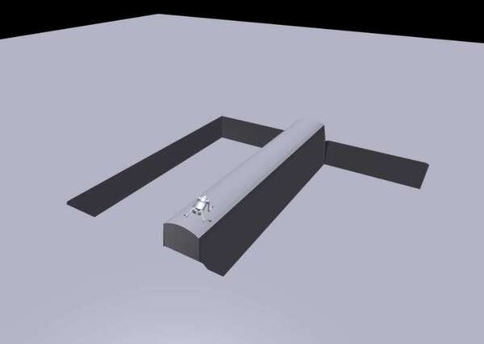
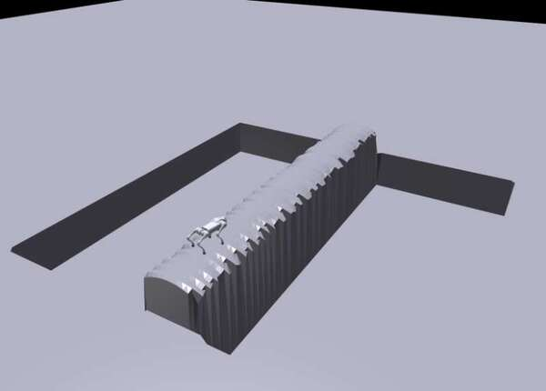
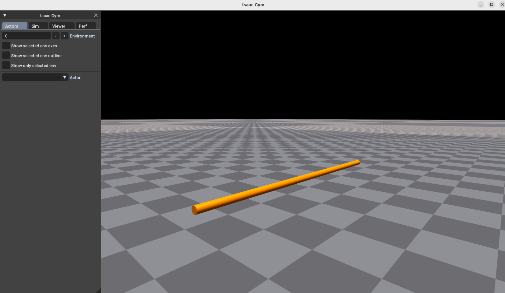

# Quadrupedal Robot Track #

Project link: [https://github.com/xiaohu-art/Single-plank.git](https://github.com/xiaohu-art/Single-plank.git)

This document recorded the progression of my developing a quadrupedal robot trained to catwalk through a single-plank environment.

Besides, it included failure experiences and some points surprising to me. I have also extended to some details and implementation that I have never been involved.

## 1. Create the single-plank bridge environment ##


Based on the other functions in `terrain.py`, the single-plank terrain is generated as below. Specifically, the `curve_height` is multiplied by 10 to mitigate the effect of `vertical_scale = 0.005`. Besides, I also modified the `env_origin` to initialize the quadrupedal robot position at the boundary of the terrain. Position perturbations are not applied as the bridge is too narrow too support random position initialization.

```python
def single_plank_terrain(terrain, radius, max_height=None):

    # max_height: to pull all the points to the same height, only used for random radius
    # radius: list of radius for each x in shape of (terrain.length,)

    # ...
    # Partial code
    for x in range(terrain.length):
        for y in range(terrain.width):
            distance = abs(y-center)
            if distance <= radius[x]:
                curve_height = np.sqrt(radius[x]**2 - distance**2) * 10
                terrain.height_field_raw[x,y] = curve_height
    # ...
```

The generated single-plank terrain are as below, the left one is the uniform radius terrain and the right one is the random radius terrain indicating the curvature change for different part of the cylinder. 

<figure class="third">
    <center>
    
    </center>
</figure>

###### PS: failure experience

*Actually I chose the invalid method at the beginning for generating terrain. Considering to use cylinder as bridge, my first thought was to create and import a urdf file then load the asset:* 



```python
# create cylinder asset
radius = 0.1
length = 8
density = 1000
cylinder_asset_options = gymapi.AssetOptions()
cylinder_asset_options.density = density
cylinder_asset = self.gym.create_capsule(self.sim, radius, length, cylinder_asset_options)

cylinder_ahandle = self.gym.create_actor(env_handle, cylinder_asset, start_pose, "cylinder", i, False, 0)
```

*I have realized that there are two actors, cylinder and robot, in each environment. So I modified the root states as:*

```python
actor_root_state = self.gym.acquire_actor_root_state_tensor(self.sim)
actor_per_env = actor_root_state // self.num_envs

self.root_states = gymtorch.wrap_tensor(actor_root_state)
self.root_states = self.root_states[::actor_per_env]
```

*And I got an error "RuntimeError: CUDA error: an illegal memory access was encountered" when indicing the `self.root_states[env_ids]`. However I couldn't find the reason along the internet so I generated the cylinder directly based on trimesh.* 

## 2. Reference trajectories by MPC

<center>
<figure>
    
    <figcaption>Visualization of catwalk gait</figcaption>
</figure>
</center>


The robot's catwalk gaits was configured by adjusting the `hip_offsets` in leg control script `raibert_swing_leg_controller.py`. I collected state-action transitions at x velocity in [0.2, 0.4, 0.6, 0.8, 1.0] with no shifting and rotation, each lasting 5 secs.

The correspondence between observations and actions in the two different simulators is shown in the following table (height map is ignored):

| IsaacGym          | PyBullet                              | dimension | Note                                        |
| ----------------- | ------------------------------------- | --------- | ------------------------------------------- |
| base_lin_vel      | robot.GetBaseVelocity()               | 3         |                                             |
| base_ang_vel      | robot.GetBaseRollPitchYawRate()       | 3         |                                             |
| projected_gravity | [0, 0, -9.81]                         | 3         | fixed                                       |
| command           | lin_speed[0], lin_speed[1], ang_speed | 3         |                                             |
| dof_pos           | robot.GetMotorAngles()                | 12        |                                             |
| dof_vel           | robot.GetMotorVelocities()            | 12        |                                             |
| last_action       | ---                                   | 12        | initialize with zero and update iteratively |
| action            | robot.GetMotorAngles()                | 12        | target position after robot step            |

Notably, the joint angles' order is also different in the two simulators. So we need to reorder it from pybullet to IsaacGym as creating the reference datasets (details in `reference/dataset.py`).


###### PS: failure experience

*The dual graphics adapters (intel and nvidia) suffered me a lot becuase the IsaacGym GUI and the PyBullet GUI seems they cannot be visualized meanwhile. After I record the demo catwalk in pybullet, the isaacgym GUI corrupted totally showing no response, at that time I forgot to visualize the environment. It lead re installation for my Ubuntu OS and the isolation from pybullet GUI after I tried thousand of methods and asked myself why not to generate reference data in IsaacGym just like the coding test mentioned.*

## 3. Train the IL and RL agent

Training commenced with an adversarial network setup inspired by the [HumanMimic](https://arxiv.org/pdf/2309.14225). The discriminator's output was integrated into the reward mechanism contributing to reinforcement learning via PPO. The Wasserstein discriminator $D_{\theta}(\cdot)$ is a series of linear layers coming with loss: $argmin_{\theta} -\mathbb{E}_{x \sim \mathcal{P_r}}[tanh(\eta D_{\theta}(x))] + \mathbb{E}_{\widetilde{x} \sim \mathcal{P_g}}[tanh(\eta D_{\theta}(\widetilde{x}))] + \lambda \mathbb{E}_{\hat{x} \sim \mathcal{P_{\hat{x}}}}[(||\nabla_{\hat{x}} D_{\theta}(\hat{x})||_2 - 1)^2]$, where $\hat{x} = \alpha x + (1-\alpha) \widetilde{x}$ are samples obtained through random interpolation between the reference samples $x$ and the generated samples $\widetilde{x}$; $\eta$ means softer constrains to unbounded values of linear outputs; $\lambda$ is the weight of the gradient penalty term. For imitation reward, it is defined as $r^{IL} = e^{D_{\theta}(\widetilde{x})}$.

The architecture and hyperparameters of the policy network are the same as the origin code in but `num_envs = 4` for debugging, the discriminator are shown below:

<table>
    <tbody>
        <tr>
            <td> Architecture </td>
            <td> [48+12, 256, 128, 1] </td>
        </tr>
        <tr>
            <td> &#951 </td>
            <td> 0.3 </td>
        </tr>
        <tr>
            <td> &#955 </td>
            <td> 10 </td>
        </tr>
        <tr>
            <td> optimizer </td>
            <td> Adam </td>
        </tr>
        <tr>
            <td> learning rate </td>
            <td> 1e-4 </td>
        </tr>
    </tbody>
</table>

The first training curve was recorded in the `./logs/go2_single_plank_imitation_num_envs_4` and the design above didn't work well. Early training phases indicated instability, attributed to excessive dominance of imitation reward (up to 137) over exploration.

As for reference dataset with length of 12500, the number of samples is `num_iter * num_epoch * batch_size * num_mini_batch = 3000 * 5 * 24 * 4 = 1.44M`. The discriminator is trained equivalently to around 100 epochs, which might also be inefficient to converge.

## 4. Scaling to multiple environments and coefficients scheduling

After simple validation of terrain and start positions, the simulation was scaled up to 4096 environments running in parallel within a Docker container. I applied clip $r^{IL}$ within $[0, 1]$ and implemented a coefficient cosine scheduling $\beta$ with cube warmup. The purpose here is to mitigate the instability of the discriminator in the early stage of training and let $r^{RL}$ to dominate after a period of imitation. 

After a series of trials and tuning, I visualized the legged robot with fixed linear velocity of 0.5 m/s and checked its performance . What I found is that the go2 robot lying on the single-plank without moving. Based on that, I penalized on motionlessness and terminate the episode if the robot collides on thigh and calf. Curve in `./log/go2_motion_terminate_4096`.

```python
class rewards:
    class scales:
        ...
        motionless = -0.005

def _reward_motionless(self):
    # Penalize no motion
    velocities = torch.norm(self.base_lin_vel, dim=1)
    is_motionless = velocities < 0.1
    return is_motionless.float()

class asset( LeggedRobotCfg.asset ):
    ...
    penalize_contacts_on = ["thigh", "calf"]
    terminate_after_contacts_on = ["base", "thigh", "calf"]
    ...
```

###### Caution

*Considerations are as following:*

+ *The combination of `single-plank`, `imitation learning` and `go2` has been showed challenging, so I removed the `imitation learning` part and training with PPO purely, of which the performance was still unsatisfactory. The curves of `rew_tracking_lin_vel` suddenly collapses at around 1.4K iterations and 4K samples. Logs are in `./logs/go2_only_ppo_terminate_4096`.*
+ *Take one more step back again, I returned to the primitive configuration and trained the go2 robot on both complex terrain and smooth slope terrain. Meanwhile I trained a1 morphology for comparison. To my surprise, the performances of go2 are much more inferior than a1, which might indicate there is some intrinsic challenges for training go2. The results can be checked in the `./logs/comparison`.*

## 5. Pretrain and fine-tune the policy

Given the mixed results aforementioned, I moved toward a pretraining approach with [unitree demo repo](https://github.com/unitreerobotics/unitree_rl_gym), focusing solely on RL rewards without imitation. The main difference in this demo repo is that the `measure_height` is ignored so the dimension of observation is 48. The pretraining curve and policy are in `./log/go2_48_pre_wo_imi`.

+ *I have also tried pretraining with imitation learning, but the performance is not as good as the pure PPO. This indicates either  imitation module's hyperparameters are not fine-tuned or reference data is not well generated. I used to read a paper about integrate a decay IL reward with RL for cassie locomotion, which I thought would be also helpful for go2 training. However, I didn't implement it due to the lack of experiences. In the other hand, experts' data might also be of low quality and accuracy, with the possibility that I utilized wrong api to estimate the state in pybullet.*
+ *I reviewed the concept of imitation learning and found it somehow introduces replaybuffer. So maybe I should also try pretraining in batch learning style, not in this online learning way, and check the performance.*
+ *Personally I have never dived into the details of `height` in isaacgym. At the beginning of this coding test I thought it would be helpful to restore the height samples so I didn't modify the origin config. It was found the height map matters, to my surprise, for go2 training with the same setting (the pretrained log above and `./log/go2_plane_ppo_pretrain`). This led me to reflect on the height map in single-plank terrain because only values in a narrow line below the robot base could support some information as I set height of other regions to negative.*

Unfortunately, the final performance of the go2 robot is still unsatisfactory. The robot can only move a few steps on the single-plank bridge and then fall down. The final training curve is in `./log/go2_48_pre_wo_imi/pretrain_loaded`.

## 6. Conclusion
To sum up, the go2 robot trained on the single-plank environment is still not able to catwalk through the bridge. The main challenges are the instability of the discriminator in the imitation learning and the difficulty of the single-plank environment. The possible reasons are the lack of high-quality reference data, the complexity of the go2 robot, and the difficulty of the single-plank environment. Correspondingly, It worths to improve the quality of the reference data, fine-tune the hyperparameters of the imitation learning, or pretraining in offline reinforcement learning. Besides, the single-plank environment can be investigated to load cylinder or capsule assets directly to simplify the terrain generation process.